# 📊 DIAGRAM USE CASE - e-CRM JASA DESAIN

**Tanggal:** 7 Desember 2025  
**Versi:** 1.0  
**Sistem:** e-CRM Jasa Desain

---

## DAFTAR DIAGRAM

1. [Use Case Diagram - Overview](#1-use-case-diagram---overview)
2. [Activity Diagram - Membuat Pesanan](#2-activity-diagram---membuat-pesanan)
3. [Activity Diagram - Upload Desain](#3-activity-diagram---upload-desain)
4. [Sequence Diagram - Membuat Pesanan](#4-sequence-diagram---membuat-pesanan)
5. [Sequence Diagram - Upload & Download Desain](#5-sequence-diagram---upload--download-desain)
6. [Data Flow Diagram - Sistem Pesanan](#6-data-flow-diagram---sistem-pesanan)
7. [State Diagram - Status Pesanan](#7-state-diagram---status-pesanan)

---

## 1. USE CASE DIAGRAM - OVERVIEW

Diagram ini menggambarkan semua use case dan aktor yang terlibat dalam sistem.

---

## 2. ACTIVITY DIAGRAM - MEMBUAT PESANAN

Diagram ini menggambarkan alur aktivitas saat client membuat pesanan baru.

---

## 3. ACTIVITY DIAGRAM - UPLOAD DESAIN

Diagram ini menggambarkan alur aktivitas saat admin mengupload hasil desain.

---

## 4. SEQUENCE DIAGRAM - MEMBUAT PESANAN

Diagram ini menggambarkan interaksi antar komponen saat membuat pesanan.

```mermaid
sequenceDiagram
    participant Client as 👤 Client
    participant View as 📄 View (Form)
    participant Controller as 🎮 OrderController
    participant Model as 💾 Order Model
    participant ClientModel as 💾 Client Model
    participant DB as 🗄️ Database

    Client->>View: Klik 'Pesan Project'
    View->>Client: Tampilkan form create order
    Client->>View: Isi form & submit
    View->>Controller: POST /ecrm/orders/store
    
    Controller->>Controller: Validasi role = 'client'
    Controller->>ClientModel: Cek user memiliki Client?
    
    alt Client belum ada
        ClientModel->>DB: Query client by email
        DB-->>ClientModel: Tidak ditemukan
        ClientModel->>DB: INSERT INTO ecrm_clients
        DB-->>ClientModel: Client created
        ClientModel->>DB: UPDATE users SET client_id
        DB-->>ClientModel: User updated
    end
    
    ClientModel-->>Controller: Client record ready
    Controller->>Controller: Validasi input form
    Controller->>Model: Order::create(data)
    Model->>Model: Boot: Generate nomor order
    Model->>DB: INSERT INTO ecrm_orders
    DB-->>Model: Order created
    Model-->>Controller: Order object
    Controller->>View: Redirect to show order
    View->>Client: Tampilkan detail order + flash message
```

---

## 5. SEQUENCE DIAGRAM - UPLOAD & DOWNLOAD DESAIN

Diagram ini menggambarkan interaksi saat upload dan download desain.

```mermaid
sequenceDiagram
    participant Admin as 👨‍💼 Admin
    participant View as 📄 View
    participant Controller as 🎮 OrderController
    participant Model as 💾 Order Model
    participant Storage as 📁 File Storage
    participant DB as 🗄️ Database
    participant Client as 👤 Client

    Note over Admin,Storage: UPLOAD DESAIN
    Admin->>View: Klik 'Upload Desain'
    View->>Admin: Tampilkan form upload
    Admin->>View: Pilih file & submit
    View->>Controller: POST /ecrm/orders/{id}/upload-desain
    
    Controller->>Controller: Validasi role = 'admin'
    Controller->>Controller: Validasi file (type, size)
    Controller->>Model: Load order
    Model->>DB: SELECT * FROM ecrm_orders
    DB-->>Model: Order data
    Model-->>Controller: Order object
    
    alt File lama ada
        Controller->>Storage: Hapus file lama
        Storage-->>Controller: File deleted
    end
    
    Controller->>Controller: Generate filename
    Controller->>Storage: Move file ke public/storage/desain/
    Storage-->>Controller: File saved
    Controller->>Model: Update desain_file
    Model->>DB: UPDATE ecrm_orders SET desain_file
    DB-->>Model: Updated
    Model-->>Controller: Success
    Controller->>View: Redirect + flash message
    View->>Admin: Tampilkan hasil desain

    Note over Client,Storage: DOWNLOAD DESAIN
    Client->>View: Klik 'Download Hasil Desain'
    View->>Controller: GET /storage/desain/{filename}
    Controller->>Controller: Validasi akses order
    Controller->>Model: Load order
    Model->>DB: SELECT * FROM ecrm_orders
    DB-->>Model: Order data
    Model-->>Controller: Order object
    Controller->>Storage: Cek file exists
    Storage-->>Controller: File found
    Controller->>View: Return file download response
    View->>Client: Download file ke komputer
```

---

## 6. DATA FLOW DIAGRAM - SISTEM PESANAN

Diagram ini menggambarkan alur data dalam sistem pesanan.

---

## 7. STATE DIAGRAM - STATUS PESANAN

Diagram ini menggambarkan transisi status pesanan.

---

## 8. ENTITY RELATIONSHIP DIAGRAM (ERD) - PESANAN

Diagram ini menggambarkan relasi antar entitas dalam sistem pesanan.

---

## 9. COMPONENT DIAGRAM - ARSITEKTUR SISTEM

Diagram ini menggambarkan komponen-komponen dalam sistem.

```mermaid
graph TB
    subgraph Frontend["🖥️ FRONTEND"]
        Views[Blade Views]
        Assets[CSS/JS Assets]
    end

    subgraph Middleware["🛡️ MIDDLEWARE"]
        Auth[Authentication]
        Role[Role Middleware]
    end

    subgraph Controllers["🎮 CONTROLLERS"]
        OrderCtrl[OrderController]
        ChatCtrl[ChatController]
        InvoiceCtrl[InvoiceController]
    end

    subgraph Models["💾 MODELS"]
        OrderModel[Order Model]
        ClientModel[Client Model]
        ChatModel[ChatMessage Model]
    end

    subgraph Database["🗄️ DATABASE"]
        MySQL[(MySQL Database)]
    end

    subgraph Storage["📁 STORAGE"]
        FileStorage[File Storage<br/>public/storage/desain/]
    end

    Views --> Auth
    Auth --> Role
    Role --> OrderCtrl
    Role --> ChatCtrl
    Role --> InvoiceCtrl
    
    OrderCtrl --> OrderModel
    OrderCtrl --> ClientModel
    ChatCtrl --> ChatModel
    
    OrderModel --> MySQL
    ClientModel --> MySQL
    ChatModel --> MySQL
    
    OrderCtrl --> FileStorage

    style Frontend fill:#e1f5ff
    style Middleware fill:#fff4e1
    style Controllers fill:#e1ffe1
    style Models fill:#ffe1e1
    style Database fill:#f5f5f5
    style Storage fill:#f0f0f0
```

---

## 10. ACTIVITY DIAGRAM - UPDATE STATUS PESANAN

Diagram ini menggambarkan alur update status pesanan oleh Admin/CS.

---

## CATATAN PENGGUNAAN DIAGRAM

### Cara Menampilkan Diagram

1. **GitHub/GitLab**: Diagram Mermaid akan otomatis dirender di markdown
2. **VS Code**: Install extension "Markdown Preview Mermaid Support"
3. **Online**: Copy kode Mermaid ke https://mermaid.live
4. **Documentation Tools**: 
   - MkDocs dengan plugin mermaid
   - Docusaurus dengan plugin mermaid
   - GitBook

### Format Diagram

Semua diagram menggunakan **Mermaid syntax** yang merupakan standar untuk diagram dalam markdown. Diagram dapat dirender di berbagai platform yang mendukung Mermaid.

### Update Diagram

Jika ada perubahan pada use case atau alur data, update diagram yang relevan di file ini untuk menjaga konsistensi dokumentasi.

---

**End of Document**

